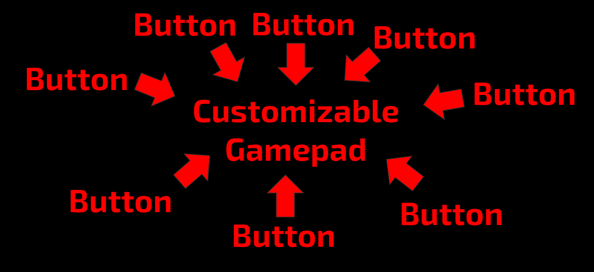

----------------------
Most people here probably know how to use input from a gamepad in their programs: You just type (gamepad1/gamepad2).(whatever button you want the input from) and you're good. In HAL, this method of getting input from the gamepad still exists, you just have to add a "robot." to the front of your reference to the gamepad (for example, `robot.gamepad1.left_stick_x` instead of `gamepad1.left_stick_x`). However, HAL also provides a much more useful method of interacting with the gamepad. Instead of referencing the gamepad controls directly, you can use a customizable gamepad. A customizable gamepad is essentially a "button manager" class; you provide it with button objects, and it will tell you the current values of each button you are interested in. At a high level, HAL customizable gamepads work a bit like this: 



## An Example: Intake Class
For instructive purposes, lets show an example of the customizable gamepad being used. Imagine for a second, that you are programming an intake subsystem with HAL. Your code currently looks like this:

```java
public class Intake extends SubSystem {

    private DcMotor leftIntake, rightIntake;
    
    public Intake(Robot robot, String leftIntakeConfig, String rightIntakeConfig) {
        super(robot);
        leftIntake = robot.hardwareMap.dcMotor.get(leftIntakeConfig);
        rightIntake = robot.hardwareMap.dcMotor.get(rightIntakeConfig);
        
        //So both intake motors spin inwards when power is positive.
        leftIntake.setDirection(DcMotor.Direction.REVERSE);
    }

    @Override
    public void init() {

    }

    @Override
    public void init_loop() {

    }

    @Override
    public void start() {
        
    }

    @Override
    public void handle(){

    }

    @Override
    public void stop() {

    }
    
    public void intake(double speed) {
        leftIntake.setPower(speed);
        rightIntake.setPower(speed);
    }
    
    public void outtake(double speed) {
        intake(-speed);
    }
    
    public void stopIntake() {
         intake(0);
    }
}
```

and you want to program it so that when the gamepad 1 a button is pressed, the intake turns on at full power, when the gamepad 1 b button is pressed, the intake reverses at full power, and when no button is pressed, the intake stops. You could do this with the normal gamepad interactions, and if that is more your style, go ahead, but for the sake of this tutorial we'll use HAL customizable gamepads and buttons to do it. First, lets create a customizable gamepad object.

```java
public class Intake extends SubSystem {

    private DcMotor leftIntake, rightIntake;
    private CustomizableGamepad gamepad;
    
    public Intake(Robot robot, String leftIntakeConfig, String rightIntakeConfig) {
        super(robot);
        leftIntake = robot.hardwareMap.dcMotor.get(leftIntakeConfig);
        rightIntake = robot.hardwareMap.dcMotor.get(rightIntakeConfig);
        
        //So both intake motors spin inwards when power is positive.
        leftIntake.setDirection(DcMotor.Direction.REVERSE);
        
        gamepad = new CustomizableGamepad(robot);
    }

    @Override
    public void init() {

    }

    @Override
    public void init_loop() {

    }

    @Override
    public void start() {
        
    }

    @Override
    public void handle(){

    }

    @Override
    public void stop() {

    }
    
    public void intake(double speed) {
        leftIntake.setPower(speed);
        rightIntake.setPower(speed);
    }
    
    public void outtake(double speed) {
        intake(-speed);
    }
    
    public void stopIntake() {
         intake(0);
    }
}
```

Notice how we defined the gamepad above the constructor, then made an instance of the gamepad inside the constructor? This was done because the customizable gamepad requires the robot object that is using the subsystem in order to access the controls internally. The robot is the only thing you need in order to create the customizable gamepad object. Now, we need to define some buttons and add them to the customizable gamepad. 

The customizable gamepad functions similarly to a hashmap, in that each button has to have a unique String id associated with it. While you could just remember the String ids of each button, I prefer to define them as constants at the top of the program so that Android studio can autocomplete them and so that I remember what each is for.

```java
public class Intake extends SubSystem {

    private static final String INTAKE = "intake button", OUTTAKE = "outtake button";

    private DcMotor leftIntake, rightIntake;
    private CustomizableGamepad gamepad;
    
    public Intake(Robot robot, String leftIntakeConfig, String rightIntakeConfig) {
        super(robot);
        leftIntake = robot.hardwareMap.dcMotor.get(leftIntakeConfig);
        rightIntake = robot.hardwareMap.dcMotor.get(rightIntakeConfig);
        
        //So both intake motors spin inwards when power is positive.
        leftIntake.setDirection(DcMotor.Direction.REVERSE);
        
        gamepad = new CustomizableGamepad(robot);
        gamepad.addButton(INTAKE, new Button<Boolean>(1, Button.BooleanInputs.a));
        gamepad.addButton(OUTTAKE, new Button<Boolean>(1, Button.BooleanInputs.b));
    }

    @Override
    public void init() {

    }

    @Override
    public void init_loop() {

    }

    @Override
    public void start() {
        
    }

    @Override
    public void handle(){

    }

    @Override
    public void stop() {

    }
    
    public void intake(double speed) {
        leftIntake.setPower(speed);
        rightIntake.setPower(speed);
    }
    
    public void outtake(double speed) {
        intake(-speed);
    }
    
    public void stopIntake() {
         intake(0);
    }
}
```

Ok, so lets break down the part where we define the buttons. 

The <Boolean> part of the declaration defines what type of data the button will return. There are currently 3 possible values that work there and will not give an error: Boolean, Double, and Vector2D. Boolean buttons will return boolean value (pressed or not pressed), double buttons will return double values, and vector buttons will return 2D vector values. 
    
The first parameter in the button constructor is a number, either 1 or 2, that tells the button which gamepad it is associated with. If the number is 1, the button will be on gamepad 1; if it is 2, it will be on gamepad 2. The last parameter in the button constructor is the button input type. This parameter is what actually specifies the specific button you are going to be using. Here we use BooleanInputs.a and BooleanInputs.b to specify that we are using the boolean a and b buttons. The other types of button inputs are DoubleInputs and VectorInputs (Just a quick sidenote, HAL has buttons that are different than the normal gamepad buttons. The normal FTC gamepad, for example, doesn't have buttons that return vector values). 

There is a third parameter in the button constructor, but it is optional. The third parameter is the deadzone, which creates a deadzone around the zero point within which the button will return 0 (or false if its a boolean button or the zero vector if it is a vector button). While it wouldn't matter for these specific buttons, other buttons (specifically those involving the gamepad joysticks and triggers) will be affected by the deadzone. After the buttons are created, they are added to the customizable gamepad object under their corresponding ids (we defined them as INTAKE and OUTTAKE at the top of the program).
  
Now that we've created our buttons, lets actually use them in `handle()` in order to accomplish our original goal!

```java
public class Intake extends SubSystem {

    private static final String INTAKE = "intake button", OUTTAKE = "outtake button";

    private DcMotor leftIntake, rightIntake;
    private CustomizableGamepad gamepad;
    
    public Intake(Robot robot, String leftIntakeConfig, String rightIntakeConfig) {
        super(robot);
        leftIntake = robot.hardwareMap.dcMotor.get(leftIntakeConfig);
        rightIntake = robot.hardwareMap.dcMotor.get(rightIntakeConfig);
        
        //So both intake motors spin inwards when power is positive.
        leftIntake.setDirection(DcMotor.Direction.REVERSE);
        
        gamepad = new CustomizableGamepad(robot);
        gamepad.addButton(INTAKE, new Button<Boolean>(1, Button.BooleanInputs.a));
        gamepad.addButton(OUTTAKE, new Button<Boolean>(1, Button.BooleanInputs.b));
    }

    @Override
    public void init() {

    }

    @Override
    public void init_loop() {

    }

    @Override
    public void start() {
        
    }

    @Override
    public void handle(){
        if(gamepad.getInput(INTAKE)) {
            intake(1);
        }
        else if(gamepad.getInput(OUTTAKE)) {
            outtake(1);
        }
        else {
            stopIntake();
        }
    }

    @Override
    public void stop() {

    }
    
    public void intake(double speed) {
        leftIntake.setPower(speed);
        rightIntake.setPower(speed);
    }
    
    public void outtake(double speed) {
        intake(-speed);
    }
    
    public void stopIntake() {
         intake(0);
    }
}
```

And there we go, our goal is accomplished! `getInput()` gets whatever gamepad input value is associated with the given button id and auto-converts it to the button's type. In this case, because we were using boolean buttons under the INTAKE and OUTTAKE ids, it will return a boolean value in both cases.

## Wouldn't it Just be Simpler to do this the Normal Way?
Well, yes, but you would miss out on a bunch of cool things that the customizable gamepad allows for. First, as was mentioned earlier, the customizable gamepad has button values that aren't available on the normal gamepad, and would have to be constructed manually. Second, It allows you to make your controls variable, as the buttons can be passed in via the constructor so you can change all your program controls by just changing how you instantiate the subsystem. For example:

```java
public class Intake extends SubSystem {

    private static final String INTAKE = "intake button", OUTTAKE = "outtake button";

    private DcMotor leftIntake, rightIntake;
    private CustomizableGamepad gamepad;
    
    public Intake(Robot robot, String leftIntakeConfig, String rightIntakeConfig, Button<Boolean> intakeButton, Button<Boolean> outtakeButton) {
        super(robot);
        leftIntake = robot.hardwareMap.dcMotor.get(leftIntakeConfig);
        rightIntake = robot.hardwareMap.dcMotor.get(rightIntakeConfig);
        
        //So both intake motors spin inwards when power is positive.
        leftIntake.setDirection(DcMotor.Direction.REVERSE);
        
        gamepad = new CustomizableGamepad(robot);
        gamepad.addButton(INTAKE, intakeButton);
        gamepad.addButton(OUTTAKE, outtakeButton);
    }

    @Override
    public void init() {

    }

    @Override
    public void init_loop() {

    }

    @Override
    public void start() {
        
    }

    @Override
    public void handle(){
        if(gamepad.getInput(INTAKE)) {
            intake(1);
        }
        else if(gamepad.getInput(OUTTAKE)) {
            outtake(1);
        }
        else {
            stopIntake();
        }
    }

    @Override
    public void stop() {

    }
    
    public void intake(double speed) {
        leftIntake.setPower(speed);
        rightIntake.setPower(speed);
    }
    
    public void outtake(double speed) {
        intake(-speed);
    }
    
    public void stopIntake() {
         intake(0);
    }
}
```

Notice how none of the code using the buttons needs to be changed, and so if we wanted to change the intake button to x and the outtake button to y, all we would have to do would be create our intake subsystem as 

```java
new Intake(this, "left intake", "right intake", new Button<Boolean>(1, Button.BooleanInputs.x), new Button<Boolean>(1, Button.BooleanInputs.y))
```

instead of 

```java 
new Intake(this, "left intake", "right intake", new Button<Boolean>(1, Button.BooleanInputs.a), new Button<Boolean>(1, Button.BooleanInputs.b))
```

Third, all button types have a special "nobutton" type that will always return the 0 value for that button type. "nobutton" wil cause a boolean button to always return false, a double button to always return 0, and a vector button to always return the zero vector. This is useful for if you want to disable controls for debugging without having to delete or comment out code, or if you want to have optional controls (you can have the controls default to nobutton unless otherwise specified). Finally, the ability to make your controls variable is **_a suprise tool that will help us later_** in the config tutorial. Trust me, it becomes _VERY_ useful.

## Other Useful Things: Toggle
While this isn't directly related to the customizable gamepad or button classes, the toggle class solves one of the most annoying problems with buttons: creating toggles. No one likes to mess around with a bunch of boolean flags trying to get a button to switch something on or off every time it's pressed, so the Toggle class is there to do it for you. Lets modify our intake class so that when the intake button is pressed, it starts the intake, and when it is pressed again, it stops the intake. We'll start with this code:

```java
public class Intake extends SubSystem {

    private static final String TOGGLE_INTAKE = "toggle intake button";

    private DcMotor leftIntake, rightIntake;
    private CustomizableGamepad gamepad;
    
    public Intake(Robot robot, String leftIntakeConfig, String rightIntakeConfig, Button<Boolean> intakeButton) {
        super(robot);
        leftIntake = robot.hardwareMap.dcMotor.get(leftIntakeConfig);
        rightIntake = robot.hardwareMap.dcMotor.get(rightIntakeConfig);
        
        //So both intake motors spin inwards when power is positive.
        leftIntake.setDirection(DcMotor.Direction.REVERSE);
        
        gamepad = new CustomizableGamepad(robot);
        gamepad.addButton(TOGGLE_INTAKE, intakeButton);
    }

    @Override
    public void init() {

    }

    @Override
    public void init_loop() {

    }

    @Override
    public void start() {
        
    }

    @Override
    public void handle(){
        
    }

    @Override
    public void stop() {

    }
    
    public void intake(double speed) {
        leftIntake.setPower(speed);
        rightIntake.setPower(speed);
    }
    
    public void outtake(double speed) {
        intake(-speed);
    }
    
    public void stopIntake() {
         intake(0);
    }
}
```

Now the first step is to define a Toggle object to serve as our, well, toggle.

```java
public class Intake extends SubSystem {

    private static final String TOGGLE_INTAKE = "toggle intake button";

    private DcMotor leftIntake, rightIntake;
    private CustomizableGamepad gamepad;
    private Toggle intakeToggle = new Toggle(Toggle.ToggleTypes.flipToggle, false);
    
    public Intake(Robot robot, String leftIntakeConfig, String rightIntakeConfig, Button<Boolean> intakeButton) {
        super(robot);
        leftIntake = robot.hardwareMap.dcMotor.get(leftIntakeConfig);
        rightIntake = robot.hardwareMap.dcMotor.get(rightIntakeConfig);
        
        //So both intake motors spin inwards when power is positive.
        leftIntake.setDirection(DcMotor.Direction.REVERSE);
        
        gamepad = new CustomizableGamepad(robot);
        gamepad.addButton(TOGGLE_INTAKE, intakeButton);
    }

    @Override
    public void init() {

    }

    @Override
    public void init_loop() {

    }

    @Override
    public void start() {
        
    }

    @Override
    public void handle(){
        
    }

    @Override
    public void stop() {

    }
    
    public void intake(double speed) {
        leftIntake.setPower(speed);
        rightIntake.setPower(speed);
    }
    
    public void outtake(double speed) {
        intake(-speed);
    }
    
    public void stopIntake() {
         intake(0);
    }
}
```

Notice how here toggle was able to be instantiated outside the constructor? This is because it works independently of the robot. If you want to keep everything consistent, however, it is completely fine to instantiate it inside the constructor as well. Toggle requires two things in its constructor: a toggle type and an initial state. There are 4 valid toggle types, each corresponding to a different behavior: flipToggle, trueOnceToggle, trueOnceAllowTurnOff, and trueWhileHeldOnce. 

FlipToggle is the easiest to understand. You press the button once to change the toggle's state, then have to release the button and press it again in order to change the button's state a second time. This can best be thought of as like a light switch. You have to press and release the switch to change the state each time. 

TrueOnceToggle is a little bit more complicated, but is very useful. It makes it so that if a button is held down, it will only return true once after being pressed. Normally, for example, holding down the b button on the gamepad would cause the button to return true as long as it is held down. The toggle makes it so that the button only returns true once immediately after it is pressed, and then will return false until the button is released and pressed again. Note that in this mode the toggle caches the true value, so it can still return true even if the button is not currently being held down. As soon as it returns a single cached true value, however, it will return false until it is set back to true again. 

TrueOnceAllowTurnOff is the same as flipToggle, but if the toggle returns a true value, it changes its state to false. This is kind of the quantum mechanics version of flipToggle. This toggle is a bit of a niche application, but is sometimes used to "buffer" controls so that they can be canceled by pressing the button before the value is checked. 

TrueWhileHeldOnceToggle is the same as trueOnceToggle, but instead of caching true values it will only return true once if the button is CURRENTLY being held. If the button is not being held at the instant it is checked, it will not return true.

The toggle's initial state is the state that it will start with. This is usually false, as it is assumed that all gamepad buttons are not being pressed at the start of a program. Now that we have our toggle, lets use it to accomplish our goal!

```java
public class Intake extends SubSystem {

    private static final String TOGGLE_INTAKE = "toggle intake button";

    private DcMotor leftIntake, rightIntake;
    private CustomizableGamepad gamepad;
    private Toggle intakeToggle = new Toggle(Toggle.ToggleTypes.flipToggle, false);
    
    public Intake(Robot robot, String leftIntakeConfig, String rightIntakeConfig, Button<Boolean> intakeButton) {
        super(robot);
        leftIntake = robot.hardwareMap.dcMotor.get(leftIntakeConfig);
        rightIntake = robot.hardwareMap.dcMotor.get(rightIntakeConfig);
        
        //So both intake motors spin inwards when power is positive.
        leftIntake.setDirection(DcMotor.Direction.REVERSE);
        
        gamepad = new CustomizableGamepad(robot);
        gamepad.addButton(TOGGLE_INTAKE, intakeButton);
    }

    @Override
    public void init() {

    }

    @Override
    public void init_loop() {

    }

    @Override
    public void start() {
        
    }

    @Override
    public void handle(){
        intakeToggle.updateToggle(gamepad.getInput(TOGGLE_INPUT));
        
        if(intakeToggle.getCurrentState()) {
            intake(1);
        }
        else {
            stopIntake();
        }
    }

    @Override
    public void stop() {

    }
    
    public void intake(double speed) {
        leftIntake.setPower(speed);
        rightIntake.setPower(speed);
    }
    
    public void outtake(double speed) {
        intake(-speed);
    }
    
    public void stopIntake() {
         intake(0);
    }
}
```

Each time the intake toggle button is pressed, the state of the toggle will update with the current value of the intake button (true or false). When `getCurrentState()` is called, the toggle will be polled for its current state. It will respond with either true or false, depending on the data that it has been given over time via `updateToggle()` and the specific type of toggle it is. In this case, each time the button is pressed, the toggle with alternate between the true state and the false state, causing pressing the button once to turn the intake on, and pressing the button a second time to turn the intake off.

### The Next Tutorial
Congratulations! You now know how to use the customizable gamepad class, the button class, and the toggle class to create a powerful system of variable controls! But remember how I said that this ability to make variable buttons was "__*a suprise tool that would help us later*__?" Well, this is because of the next tutorial, [Config: The Art and Science of Making Hardware do all the Work](hal-config.md), which takes this ability and makes it even more powerful.
