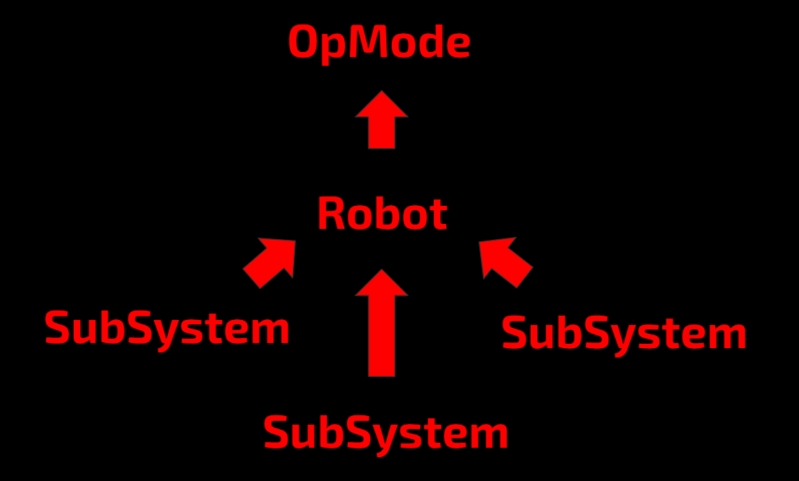

----------------
## The Basic Structure of a HAL Program
   To create a program in HAL, you need 3 things: one or more subsystems, a robot, and an opmode. The robot controls all of your subsystems, and sets up the conditions under which they will run (turning on the GUI, defining the cameras, ect). Each subsystem contained within the robot is where you tell the robot _how_ to do something and when to do something _automatically_. It is where you put the specific code for making motors spin, servos turn, and computer vision to run. Finally, the opmode is where you tell the subsystems _what you want them to do_ by controlling them through the robot. It is where you control what each subsystem is doing _manually_. Essentially, the robot manages the subsystems, and the opmode manages the robot.

In image form, the general structure of a HAL program looks like this:



## Making Your First Subsystem
   In order to make your first subsystem, you will first need to create a new java class in the teamcode folder. In this example I will call it MySubSystem.java:
   
```java
public class MySubSystem {

}
```

Now, in order for this to be a subsystem class, it must extend the base subsystem class. The keyword, extend, basically translates as "is a type of," so by changing the code to this:
```java
public class MySubSystem extends SubSystem {

}
```
we are saying that MySubSystem is a type of SubSystem.

Now, after doing that you may have noticed a red line was created under the `public class MySubSystem extends SubSystem` line. This is because every subsystem has a set of functions that must be overridden in order for it to function. In order to avoid typing all these functions, you can right click in between the curly brackets, click generate, then click implement methods and ok. That should change your code to this:
   
```java
public class MySubSystem extends SubSystem {
    @Override
    public void init() {

    }

    @Override
    public void init_loop() {

    }

    @Override
    public void start() {

    }

    @Override
    public void handle() {

    }

    @Override
    public void stop() {

    }
}
```

   Now you may have noticed that there is still a red line under `public class MySubSystem extends SubSystem`. This is because you also need to create a constructor for your subsystem. A constructor is a function that is run every time a new instance of your subsystem is created. If you use the generate tool again to create your constructor (click generate, constructor instead of generate, implement methods), your final empty subsystem class will look like this (Note: by convention constructors are on the top of a class):
   
```java
public class MySubSystem extends SubSystem {

    public MySubSystem(Robot robot) {
        super(robot);
    }

    @Override
    public void init() {

    }

    @Override
    public void init_loop() {

    }

    @Override
    public void start() {

    }

    @Override
    public void handle() {

    }

    @Override
    public void stop() {

    }
}
```

Ok, now lets talk about each of the functions in detail.

### The Constructor
The constructor is where you put everything that you want to happen when your class is first created. For example, hardwaremapping the motors and setting their directions would most likely go in the constructor. Every subsystem constructor must take a robot as input. This robot is the robot using the subsystem, and will be used throughout your code, as it contains things that are used frequently in FTC, like hardwaremap, gamepad1, and gamepad2 (you would access these variables by doing things like robot.hardwaremap or robot.gamepad1).
   
The constructor can also take other objects as parameters in addition to the robot, you just need to add more parameters as if you were adding parameters to a function. For example, if you wanted the user to provide a string (perhaps for hardwaremapping) to the subsystem in order for it to be created, you would change the constructor line to `public MySubSystem(Robot robot, String hardwaremap_config)`. The `super(robot)` line takes the robot and passes it to the base subsystem class, which does stuff with it internally. You don't have to worry too much about the super(robot) line, just make sure it is always the first line in your constructor.
   
### init()
The init() function runs once immediately after you press the initialize button on the robot controller. The init() functions of every subsystem in the robot are run automatically, so you most likely will never need to call init() explicitly.
   
### init_loop()
As its name suggests, this function runs over and over again after you press the init() button, then stops once you press the start button. If you want to do something in a loop after your robot is initialized, you would put it here.
   
### start()
Start runs once when you press the start button. This is where you will do things that need to be set up right before the program runs, but can't be set in init() (like configuration settings, which are covered later).
   
### handle()
Handle is a bit of a weird function. While every other function gets run in both autonomous and teleop programs, **handle() is only run in teleop**. It runs over and over again in a loop. This is where the main teleop code for your subsystem should go.
   
### stop()
Stop runs when you stop the program. You would put cleanup code here in case you wanted to be extra sure that no still-running code causes problems when you stop the robot.

### How to Program the Subsystem
In order to program the subsystem, adopt a mindset of telling the subsystem how to do something, and then when to do it. For example, if I wanted to make the robot drive in a certain direction on start, I would write a drive() function that tells it how to drive, then use that function in the start() function. This will help a LOT for writing autonomous programs.

Here is an example of this type of programming style:

```java
public class MySubSystem extends SubSystem {

    public MySubSystem(Robot robot) {
        super(robot);
    }

    @Override
    public void init() {

    }

    @Override
    public void init_loop() {

    }

    @Override
    public void start() {
    
    }

    @Override
    public void handle() {
        /*
        This is where we tell the robot WHEN to do this task. 
        Here we are taking the input of the gamepad and plugging
        it into the function. 
        
        If this was a driving function, 
        it would drive the robot at the power provided by the gamepad. 
        
        There is a much better way to access the gamepad controls, 
        but this will be covered in a later tutorial.
        */
        doThisCoolThing(robot.gamepad1.left_stick_x);
    }

    @Override
    public void stop() {

    }

    public void doThisCoolThing(double parameter) {
        /*
        Put code to define HOW to do this cool thing here. 
        If this was a driving function, for example, 
        you would have the robot drive at the specified power 
        (parameter).
        */
    }
}
```

## The Next Step
Congratulations! You now know how to create a basic subsystem! The next step in the process of creating a HAL program is to make a robot class. This is covered in the next tutorial: [building a robot](building-a-robot.html).
